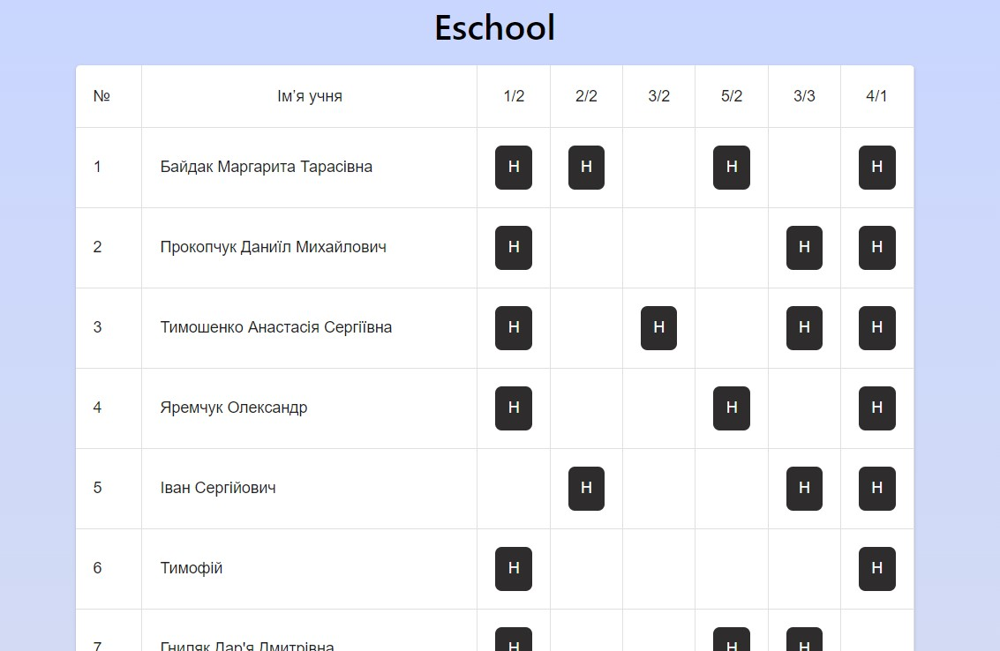

# ESCHOOL

This project is a student management system for an education school that allows teachers to track student attendance and view detailed information about each student.

## Functionality

- **Table with Students**: View the list of students in table format.
- **Presence/Absence Marks**: Teachers can mark absence or presence for each student.
- **Student Detail Page**: View detailed information about a student

## Technology stack

React.js, React-Query, MUI
